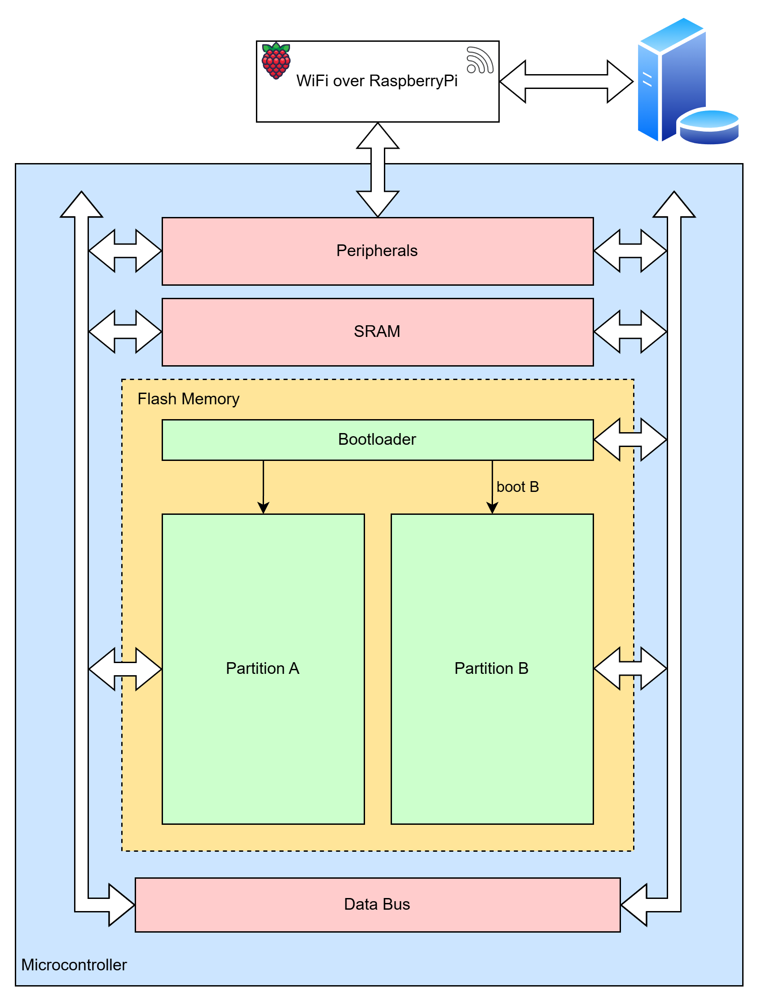
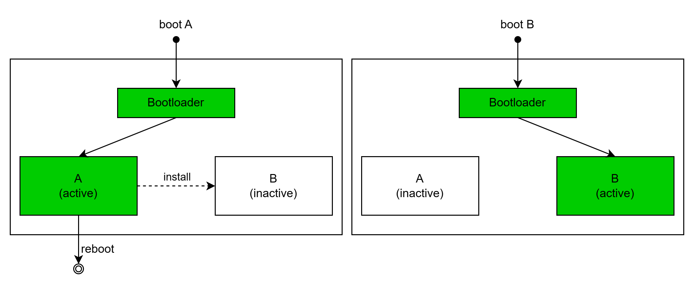
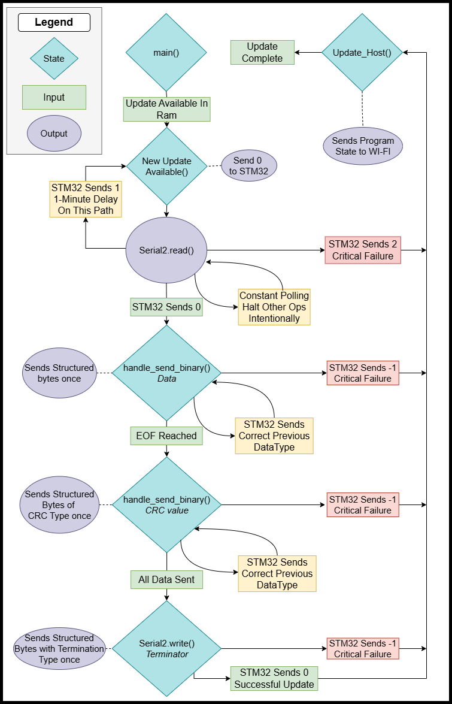

# OTA Firmware Update Project

Reliable A/B firmware update foundation for STM32 with an ESP32 transport bridge.  
Here is the final presentation video showing a demo and explanation of everything in this readme:

## Demo Videos
https://youtu.be/UHACsZe9ke4  
https://youtube.com/shorts/yXXsLTlftgA?feature=share

## Table of Contents
* [Project Overview](#project-overview)
* [System Architecture](#system-architecture)
* [Hardware Interfaces & Wiring](#hardware-interfaces--wiring)
* [Basic Setup Instructions](#basic-setup-instructions)
* [Flowcharts](#flowcharts)
* [Current Implementation Status](#current-implementation-status)
* [Repository Layout](#repository-layout)
* [Authors](#authors)

## Project Overview

### Purpose
Many embedded products are deployed in places where physical reflashing is slow, costly, or impossible. A failed firmware update can also brick a device if there is no recovery path. This project builds a robust over-the-air (OTA) update pipeline for an STM32 platform to solve this problem.

### Functionality
The system utilizes an A/B swap firmware update layout. The design keeps one known-good binary active while writing a new downloaded binary to an inactive slot. This allows updates to be validated before they become permanent. The update download process is concurrent. Main application tasks are not halted while the new binary is fetched.

Key components:
* A custom STM32 bootloader validates candidate app binaries at boot.
* The same application is built twice into Slot A and Slot B with specific binary information.
* OTA update workflow metadata is stored in flash with power-fail-safe writes.
* An ESP32 transport companion delivers update payloads to the STM32 application over UART.

## System Architecture

End-to-end update path:
1. A new firmware binary file is delivered over the network to the ESP32 bridge (stored at https://github.com/anton2uha/OTAfiles).
2. HiveMQ sends a fetch request to the ESP32. The ESP32 downloads the binaries to its local flash.
3. The running STM32 application receives the payload from the ESP32 via UART and writes it to the dormant flash bank.
4. The application marks the dormant slot as pending and reboots.
5. The bootloader validates available slots (integrity, CRC) and selects the boot target with the highest version.
6. The new app image confirms itself after health checks.

### Architecture Diagrams
  



## Hardware Interfaces & Wiring

[PLACEHOLDER: Insert Wiring Diagram Here]

### ESP32 to STM32 UART Pinout
| ESP32 | STM32 |
|---|---|
| GPIO17 (TX) | RX pin (PC5) |
| GPIO16 (RX) | TX pin (PC4) |
| GND | GND |

### STM32 Interfaces
* `UART3`: OTA data path from ESP32 to STM32 (Pins PC4, PC5).
* `UART4`: Debug output path.

### ESP32 Interfaces
* `UART0`: USB serial to receive new programs via PlatformIO.
* `UART2`: Binary transfer path toward STM32 OTA updater.

## Basic Setup Instructions

### 1. ESP32 Bridge Setup
**Requirements:** VS Code with PlatformIO extension, HiveMQ Cloud account (free tier), and a 2.4GHz WiFi network.

1. Configure WiFi credentials in `ota_esp32/src/main.cpp`:
   ```cpp
   const char* ssid = "your_network";
   const char* password = "your_password";
   ```
2. Configure the server URL and MQTT credentials in `ota_esp32/src/main.cpp`:
   ```cpp
   #define MQTT_BROKER "your-cluster.hivemq.cloud"
   #define MQTT_USER   "your_username"
   #define MQTT_PASS   "your_password"
   ```
   Update the IP in `fetchBinary()` and `checkForUpdate()` to point to your hosted binaries.
3. Build and upload using PlatformIO. Ensure the ESP32 device is connected via USB. Note: If using WSL, ensure your user is in the `dialout` group to access `/dev/ttyUSB0`.

### 2. STM32 Firmware Setup
**Requirements:** CMake and ARM GCC toolchain.

1. Navigate to the `OTA` directory.
2. Run the following CMake commands to build the bootloader and the two application slots:
   ```bash
   cmake --preset Debug -B build/Debug
   cmake --build build/Debug --target OTA_bootloader
   cmake --build build/Debug --target OTA_app_a
   cmake --build build/Debug --target OTA_app_b
   ```
3. Flash the generated `.elf` or `.hex` files to the STM32 starting at address `0x08000000` for the bootloader.

## Flowcharts

### Bootloader FSM


### UART ESP32 to STM32 Protocol FSM


## Current Implementation Status

* Implemented A/B flash partitioning and custom bootloader runtime.
* Runtime slot probing with vector checks, manifest checks, CRC checks, and version comparison.
* Shared app source built into two linked images (Slot A and Slot B).
* Power-fail-safe metadata persistence with scratch-page journaling.
* STM32 app-side `UART3` framed OTA receive/write pipeline.
* ESP32 protocol bridge integration.

## Repository Layout

* `OTA`: STM32 firmware workspace.
* `OTA/README.md`: Technical details on file map, flash map, and build/flash details.
* `OTA/PROJECT_HANDOVER.md`: Detailed architecture and roadmap.
* `OTA/ota_esp32`: ESP32 companion workspace.

## Authors

* Sameeran Chandorkar
* Jeffrey Hansen
* Nick Baret
* Anthony Lesik
